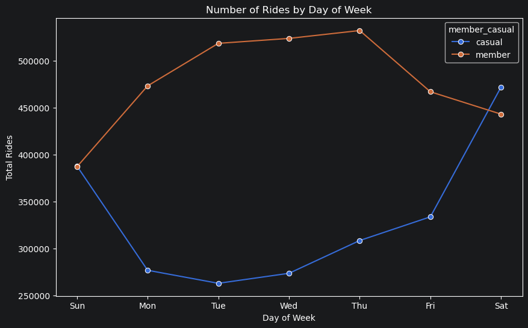
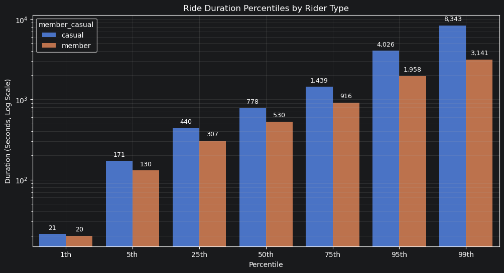

# Cyclistic Bike-Share Case Study  

SDI 5313 – Data Analytics  
University of Oklahoma Polytechnic Institute  

## Overview

This repository contains the SQL queries, documentation, and supporting materials for the Cyclistic Case Study project completed as part of SDI 5313 Data Analytics. The project is organized into four milestones:

1. **Milestone 1:** Business Understanding & Analytical Planning  
2. **Milestone 2:** Data Preparation & SQL-Based Processing  
3. **Milestone 3:** Exploratory Analysis & Visualization  
4. **Milestone 4:** Storytelling, Recommendations & Presentation  

The goal of the project is to analyze historical bike-share data to understand behavioral differences between *casual riders* and *annual members*, and to use those insights to inform strategies that could increase annual memberships.

## Tools Used

- **XAMPP**
- **Apache**
- **MariaDB**
- **SQL**
- **Tableau**
- **Python**
- **Spreadsheet tools** (Excel/Sheets)

## Repository Structure

The repository is organized around the following files and folders:

```
/images/
/sql/
    ├── milestone2_01_create_database.sql
    ├── milestone2_02_create_rides_table.sql
    ├── milestone2_03_insert_values.sql
    ├── milestone2_04_analyze.sql
    ├── milestone2_05_delete_missing_coords.sql
    ├── milestone2_06_cleaning.sql  
    └── milestone2_07_add_columns.sql

cyclistic_analyze.ipynb
environment.yml (for .ipynb)
LICENSE
README.md
```

> **Note:** Raw datasets are *not* included in this repository in accordance with project guidelines. All data files are stored securely outside GitHub, such as in OU OneDrive.

## Project Description

Cyclistic is a fictional bike-share company operating in a major metropolitan area. The company offers two rider types, casual riders and annual members, and seeks to understand how their usage patterns differ. This analysis supports the broader business question:

**How do casual riders and annual members differ in their bike usage behavior, and how can these differences inform strategies to increase annual memberships?**

Throughout the project, we progressively:

- Define the business context and analytical focus  
- Prepare and clean the data using SQL  
- Explore and visualize usage patterns  
- Develop insights and recommendations for stakeholders

# Milestone 2: Data Preparation & SQL-Based Processing

This milestone focuses on preparing Cyclistic’s trip-level data for analysis.

## Step 1: Download tripdata

Start by downloading `tripdata.7z` and extracting it.
- It contains 12 months of divvy-tripdata for 2022.
- The file format is .csv

The following is an example of what you can find in the file:

| ride_id          | rideable_type | started_at      | ended_at        | start_station_name            | start_station_id | end_station_name              | end_station_id | start_lat | start_lng | end_lat  | end_lng   | member_casual |
|------------------|---------------|-----------------|-----------------|-------------------------------|------------------|-------------------------------|----------------|-----------|-----------|----------|-----------|---------------|
| C2F7DD78E82EC875 | electric_bike | 1/13/2022 11:59 | 1/13/2022 12:02 | Glenwood Ave & Touhy Ave      | 525              | Clark St & Touhy Ave          | RP-007         | 42.0128   | \-87.6659 | 42.01256 | \-87.6744 | casual        |
| A6CF8980A652D272 | electric_bike | 1/10/2022 8:41  | 1/10/2022 8:46  | Glenwood Ave & Touhy Ave      | 525              | Clark St & Touhy Ave          | RP-007         | 42.01276  | \-87.666  | 42.01256 | \-87.6744 | casual        |
| BD0F91DFF741C66D | classic_bike  | 1/25/2022 4:53  | 1/25/2022 4:58  | Sheffield Ave & Fullerton Ave | TA1306000016     | Greenview Ave & Fullerton Ave | TA1307000001   | 41.9256   | \-87.6537 | 41.92533 | \-87.6658 | member        |

The goal is to transform raw, multi-file data into a clean, consistent dataset that supports reliable analysis in later stages.

No insights are generated at this stage; the emphasis is on data quality and structure.

## Step 2: Data Integration

We need to combine these files into a single dataset using SQL to enable year-long analysis.

We use XAMPP with Apache and MySQL.

SQL commands are used to import the files.

We first verified that the files shared a consistent structure:

- Checked the header rows manually and confirmed they matched.
- Reviewed the date columns and inspected the remaining columns for obvious patterns.
- SQL load errors also helped reveal mismatches during table setup.

Place all 12 monthly files in C:/xampp/tmp/. They will be merged into one table in the upcoming steps.

Make sure both Apache and MySQL services are running in XAMPP. All tasks will be done through http://localhost/phpmyadmin/.

These steps should be run in the SQL query window in phpMyAdmin.

See [milestone2_01_create_database.sql](sql/milestone2_01_create_database.sql) for how to create the database. You can also create it using the phpMyAdmin UI.

See [milestone2_02_create_rides_table.sql](sql/milestone2_02_create_rides_table.sql) for the SQL code to create the table.

If you are starting from scratch, make sure the `cyclistic_2022` database is created and selected first, then click `rides` before loading or querying data.

See [milestone2_03_insert_values.sql](sql/milestone2_03_insert_values.sql) for the SQL code to load the CSV data into the table.

Before you paste and run a query, click the `rides` table in the left sidebar so the command runs in the correct scope.

If phpMyAdmin shows the database name in the breadcrumb above the query window, that is a good sign you are in the right place.

See [milestone2_04_analyze.sql](sql/milestone2_04_analyze.sql) for the procedure used to inspect the table structure and null counts.

After inserting all 12 files, we can analyze the table:

```sql
SELECT * FROM `rides` PROCEDURE ANALYSE()
```

| Field_name                              | Min_value                | Max_value        | Min_length | Max_length | Empties_or_zeros | Nulls  |
|-----------------------------------------|--------------------------|------------------|------------|------------|------------------|--------|
| cyclistic_2022.rides.id                 | 1                        | 5667717          | 1          | 7          | 0                | 0      |
| cyclistic_2022.rides.ride_id            | 00000123F60251E6         | FFFFFCFA2D52CEB7 | 16         | 16         | 0                | 0      |
| cyclistic_2022.rides.rideable_type      | classic_bike             | electric_bike    | 11         | 13         | 0                | 0      |
| cyclistic_2022.rides.started_at         | 1/1/2022 0:00            | 12/31/2022 23:59 | 19         | 19         | 0                | 0      |
| cyclistic_2022.rides.ended_at           | 1/1/2022 0:01            | 1/2/2023 4:56    | 19         | 19         | 0                | 0      |
| cyclistic_2022.rides.start_station_name | 10101 S Stony Island Ave | Zapata Academy   | 7          | 64         | 0                | 833064 |
| cyclistic_2022.rides.start_station_id   | 21320                    | WL-012           | 3          | 44         | 0                | 833064 |
| cyclistic_2022.rides.end_station_name   | 10101 S Stony Island Ave | Zapata Academy   | 9          | 64         | 0                | 892742 |
| cyclistic_2022.rides.end_station_id     | 21320                    | WL-012           | 3          | 44         | 0                | 892742 |
| cyclistic_2022.rides.start_lat          | 41.64                    | 45.635034        | 18         | 18         | 0                | 0      |
| cyclistic_2022.rides.start_lng          | \-87.84                  | \-73.796477      | 18         | 18         | 0                | 0      |
| cyclistic_2022.rides.end_lat            | 41.55                    | 42.37            | 18         | 18         | 8                | 5858   |
| cyclistic_2022.rides.end_lng            | \-88.14                  | \-87.3           | 18         | 18         | 8                | 5858   |
| cyclistic_2022.rides.member_casual      | casual                   | member           | 6          | 6          | 0                | 0      |

Notice that `end_lat` and `end_lng` have NULL values. These are critical measures, and we need to drop those rows to improve future analysis.
The missing `station_name`s and `station_id`s were less concerning, as long as we had the start and end coordinates.

## Table Design Rationale

**Note:** I first tried loading the 12 CSV files into a simpler table design, but the biggest files were taking up to 200 seconds to finish importing. After testing the data and seeing where the bottlenecks were, I rebuilt the table with the following format [milestone2_02_create_rides_table.sql](sql/milestone2_02_create_rides_table.sql) to make loading and lookups more efficient.

The final structure was chosen for a few practical reasons:

- `ride_id` is stored as `char(16)` with `ascii_bin` so the identifier stays compact and compares efficiently.
- `id` is a `mediumint unsigned auto_increment` primary key, which gives each row a fast internal lookup key.
- The table is partitioned by `started_at` so date-based work can be organized more efficiently.
- Both `started_at` and `ended_at` use `datetime` to integrate the data easily. 
- The `varchar` sizes were based on the largest values observed in the source data, which keeps the schema realistic without wasting space.
- `decimal` is used for latitude and longitude so coordinate values stay accurate and avoid floating-point precision issues.
- `enum` is used for fields with a small set of known values, such as `rideable_type` and `member_casual`, because that keeps the table consistent and efficient.

With those changes in place, the largest CSV finished importing in under 7 seconds.

## Step 3: Data Cleaning

We started by cleaning up the missing ending coordinates. See [milestone2_05_delete_missing_coords.sql](sql/milestone2_05_delete_missing_coords.sql).

Many values were standardized or cleaned up when they were inserted into the table.

However, see [milestone2_06_cleaning.sql](sql/milestone2_06_cleaning.sql) for steps including checking duplicate entries and filtering invalid records.

## Step 4: Data Transformation

New virtual variables were created to support analysis, with no extra storage because they are computed on SELECT:

- `ride_duration_sec` (from start and end times)
- `started_date` (DATE(started_at))
- `started_dow` (DAYOFWEEK(started_at))
- `started_month` (MONTH(started_at))
- `started_hour` (HOUR(started_at))
- `time_of_day` (ENUM('early_morning','morning','midday','afternoon','evening','night'))

These transformations help enable comparison between rider types.

See [milestone2_07_add_columns.sql](sql/milestone2_07_add_columns.sql) to see how to do this.

## Step 5: Data Validation

Final checks were performed to ensure consistency:

- Verified row counts and uniqueness
- Reviewed summary values for anomalies
- Confirmed accuracy of derived variables
- The dataset is now analysis-ready.

# Milestone 3: Exploratory Analysis & Tableau Dashboard

This milestone focuses on exploratory data analysis (EDA) using Python and SQL to uncover behavioral differences between rider types.

## Summary Insights & Correlation Interpretation

Based on the analysis and the correlation matrix, we can draw the following conclusions:

- **Positive correlation between 'is_casual' and 'ride_duration_sec':** Confirms casual riders take significantly longer rides. Even after accounting for extreme outliers, the behavioral "middle" for casual riders is higher.
- **'is_casual' and 'type_docked_bike':** In the 2022 dataset, 'docked_bike' usage is exclusively casual. This is a strong behavioral signal!
- **'is_member' and 'type_classic_bike':** Members show a stronger preference/usage for classic bikes, which are often the reliable choice for point-to-point commuting.
- **'is_casual' and 'type_electric_bike':** There is a slight preference towards electric bikes for casual riders, perhaps for the "novelty" or to cover longer distances without exertion during leisure trips.
- **Weekday vs. Weekend:** Annual members have a consistent and dominant ride count during weekdays, likely for commuting. Casual riders show a significant spike in rides during the weekends, where they match or exceed member volume.
- **Time of Day:** Peak usage for both groups occurs in the afternoon and evening, but members have a secondary peak in the morning (commute hours).
- **Seasonality:** Summer months (June–August) show the highest activity for both groups, but the increase is more pronounced for casual riders.
- **Average Trip Distance:** Casual riders often have slightly longer or similar straight-line distances despite much longer durations, possibly suggesting leisure/sightseeing behavior (riding in loops) rather than point-to-point utility.
- **Round Trips:** Casual riders are significantly more likely to start and end at the same location, which is a hallmark of recreational riding rather than utility-based transportation.
- **Geographical Hotspots:** Casual rides are heavily concentrated in coastal/tourist areas, while members are more evenly distributed across the city's grid and business districts.

## Proposed Strategies to Increase Annual Memberships

1. **"Weekend Warrior" or "Leisure" Membership:** Targeted at the casual riders who currently only use the service on Saturdays and Sundays.
2. **"Commuter Trial" for Casuals:** Since casual riders are low on weekdays, offering a "Mid-week Pass" or "Commute Discount" could encourage them to try biking to work.
3. **Electric Bike Incentives:** Since casual riders use electric bikes slightly more, a membership that includes discounted e-bike minutes could be a strong draw.
4. **Docked Bike Analysis:** Investigating why casuals use 'docked_bikes'—if it's related to specific high-traffic tourist areas, targeted ads in those locations for "Commuter Memberships" could work.
5. **Long-Duration "Passes":** Converting casual riders who take 30+ minute trips by showing them the "break-even" point of an annual membership.
6. **"Scenic Loop" Memberships:** Since casual riders frequently perform round trips, a membership tier that emphasizes leisure use could capture this specific demographic.

## Visualizations

The full exploratory analysis, including code and charts, can be found in the [cyclistic_analyze.ipynb](cyclistic_analyze.ipynb) notebook.

### Two Key Behavioral Charts:

---



---



---

A **Tableau dashboard** will be created to provide an interactive way to showcase these results to stakeholders.
